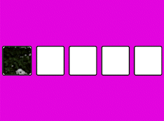

# About

This project is a bit of drag and drops functionality. 
The application is composed of styled divs with a background image from [Unsplash](https://unsplash.com).
A grabbed image has the functionality of grabbing a single image. Once the picture hovers, the div displays a dashed dark background that can hold the picture on it.
For the Drag and Drop functionality used from the [mdn](https://developer.mozilla.org/en-US/) docs,  the [drag event](https://developer.mozilla.org/en-US/docs/Web/API/Document/drag_event).

## Application Preview

